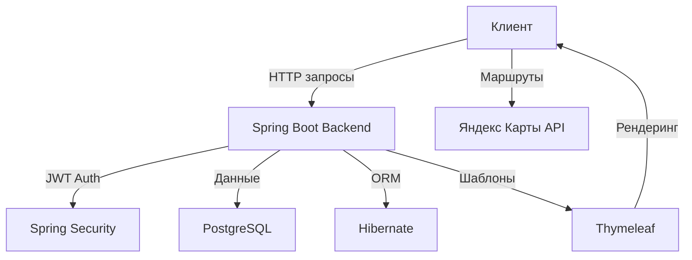
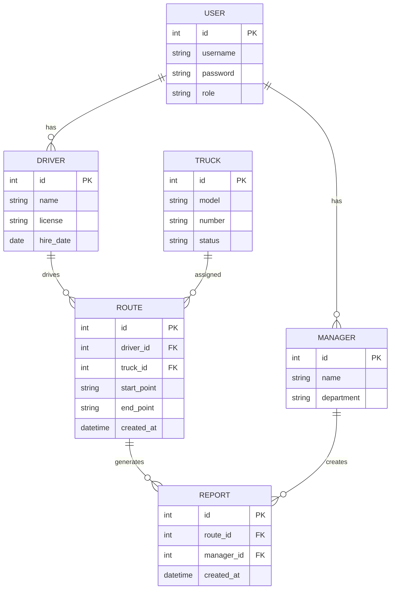
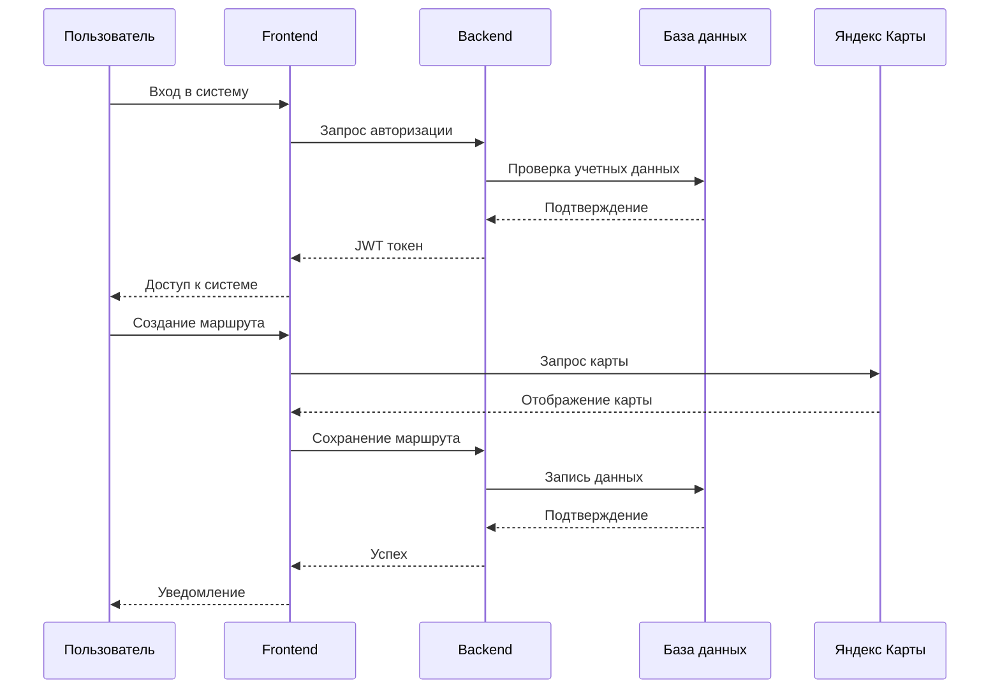

# 🚛 Система управления транспортной компанией

<div align="center">
  
### Курсовая работа по дисциплине «Современные технологии программирования»

## Тема: "Информационно-справочная система для управления транспортной компанией: Создание системы для планирования маршрутов, учета водителей и транспортных средств"

### Выполнил студент 3-его курса Гизатулин Никита Александрович
### Группа: ПИ22-1

---

<div align="center">
  
  
  
  
  
</div>

<div align="center">
  <p>
    
    
    
    
    
    
    
    
    
  </p>
</div>

</div>

## 📋 Обзор проекта
Данный проект представляет собой комплексную систему управления транспортной компанией, реализованную с использованием клиент-серверной архитектуры. Система обеспечивает полный цикл управления транспортными средствами, маршрутами, водителями и формированием отчетности.

## 🔧 Технологический стек

### Серверная часть (Backend)


- Spring Web MVC для создания RESTful API
- Spring Data JPA для работы с базой данных
- Spring Security для обеспечения безопасности
- JWT для аутентификации и авторизации
- Hibernate для ORM
- Lombok для уменьшения шаблонного кода

### Клиентская часть (Frontend)


- Thymeleaf для создания динамических веб-страниц
- HTML5 для разметки веб-страниц
- CSS3 для стилизации (Flexbox, Grid, анимации)
- JavaScript для клиентской логики
- Яндекс Карты API для визуализации маршрутов
- Bootstrap 5 для адаптивного дизайна

## 🏗 Архитектура проекта



## 📊 Диаграмма базы данных



## 🔐 Безопасность


- Аутентификация на основе JWT токенов
- Шифрование паролей с использованием BCrypt
- Ролевая модель доступа (RBAC)
- Защита от CSRF атак
- Настроенная CORS политика
- Валидация всех входных данных
- Защита от SQL-инъекций
- Аудит действий пользователей

## 🎨 Особенности интерфейса

### Дизайн
- Material Design
- Адаптивная верстка
- Темная и светлая темы
- Анимированные переходы
- Интерактивные элементы

### Карты и маршруты
- Интеграция с Яндекс Картами
- Визуализация маршрутов
- Drag-and-drop точек
- Оптимизация маршрута
- Расчет времени и расстояния

## 📝 Установка и запуск

```bash
# Клонирование репозитория
git clone https://github.com/yourusername/transport-company.git

# Настройка базы данных
psql -U postgres -f database/init.sql

# Настройка переменных окружения
cp .env.example .env

# Сборка проекта
mvn clean install

# Запуск приложения
java -jar target/transport-company.jar
```

## 🔄 Процесс работы системы



---

<div align="center">
  
### 📞 Контакты для связи

[Telegram](mailto:https://t.me/butcher044)

</div>
